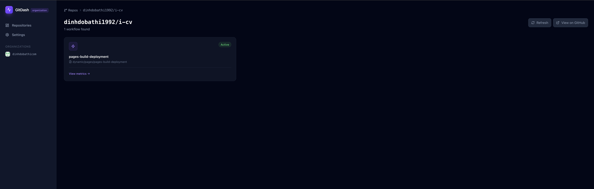
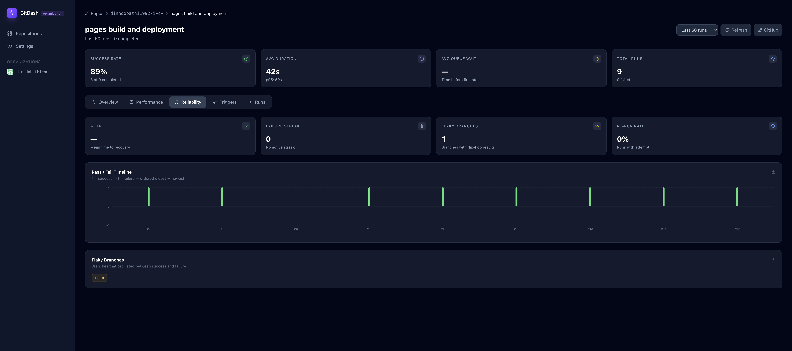

# GitDash

A self-hosted GitHub Actions metrics dashboard. Browse your personal and organization repositories, and explore deep workflow metrics — success rates, durations, reliability trends, trigger patterns, and job-level breakdowns.


[](https://snyk.io/test/github/dinhdobathi1992/gitdash)

---

## Screenshots

**Repository list** — fuzzy search, org switcher, workflow status chips



**Overview tab** — stat cards, rolling success rate, duration trend, outcome breakdown, run frequency


**Performance tab** — job avg/p95 bar chart and stacked job composition waterfall


**Performance tab** — slowest steps table with avg, p95, max and success %


**Reliability tab** — MTTR, failure streak, flaky branches, pass/fail timeline



**Triggers tab** — event breakdown, top branches, actor leaderboard


**Runs tab** — sortable table with commit messages, PR links, and CSV export


---

## 🔒 Your PAT is Yours — We Protect It Like It's Gold

**Your GitHub Personal Access Token (PAT) is the most sensitive credential you'll entrust to this application.** We understand that. GitDash is designed from the ground up to protect your token with multiple layers of defense.

### ✅ What We DO

- ✅ **Encrypt your PAT** with AES-256-GCM using [iron-session](https://github.com/vvo/iron-session) — industry-standard encryption
- ✅ **Store it in an HTTP-only cookie** — JavaScript in the browser **cannot** read it (XSS protection)
- ✅ **Enforce HTTPS in production** — your PAT is never sent over plain HTTP
- ✅ **Validate your PAT before storage** — invalid tokens are rejected immediately
- ✅ **Rate-limit PAT submissions** — 5 attempts per minute per IP (brute-force protection)
- ✅ **Never log your PAT** — server logs contain only metadata (IP, timestamp), never the token itself
- ✅ **Clear your PAT on logout** — `session.destroy()` removes it from the cookie immediately
- ✅ **Run as non-root in Docker** — container breakout cannot access host files

### ❌ What We DON'T Do

- ❌ **NEVER store your PAT in localStorage or sessionStorage** — verified with `grep -r "localStorage\|sessionStorage" src/` → **0 matches**
- ❌ **NEVER send your PAT in URL query parameters** — always in POST body, never in logs
- ❌ **NEVER send your PAT to third parties** — it stays between you, this app, and GitHub
- ❌ **NEVER expose your PAT in API responses** — verified with `grep -r "return.*pat\|json.*pat" src/` → **0 matches**
- ❌ **NEVER auto-save your PAT in browser password managers** — `autoComplete="off"` on input field
- ❌ **NEVER use a weak encryption secret** — `SESSION_SECRET` must be 32+ characters or the app refuses to start in production

### 🔍 Proof: PAT Protection at Every Layer

```
┌─────────────────────────────────────────────────────────────────────────┐
│ Layer 1: Client-Side                                                    │
├─────────────────────────────────────────────────────────────────────────┤
│ ✓ Stored in React state (memory) — cleared on page unload              │
│ ✓ Input type="password" — hidden by default                            │
│ ✓ autoComplete="off" — browser won't save it                           │
│ ✓ NOT in localStorage, sessionStorage, or IndexedDB                    │
└─────────────────────────────────────────────────────────────────────────┘
                                    │
                                    ▼
┌─────────────────────────────────────────────────────────────────────────┐
│ Layer 2: Network Transmission                                           │
├─────────────────────────────────────────────────────────────────────────┤
│ ✓ HTTPS enforced (HTTP→HTTPS redirect in production)                   │
│ ✓ POST with JSON body (not URL query string)                           │
│ ✓ Rate limited: 5 attempts/minute per IP                               │
│ ✓ Validated against GitHub API before accepting                        │
└─────────────────────────────────────────────────────────────────────────┘
                                    │
                                    ▼
┌─────────────────────────────────────────────────────────────────────────┐
│ Layer 3: Server-Side Storage                                            │
├─────────────────────────────────────────────────────────────────────────┤
│ ✓ AES-256-GCM encryption (iron-session v8.0.4)                         │
│ ✓ HTTP-only cookie (JavaScript CANNOT read it)                         │
│ ✓ Secure flag (HTTPS only in production)                               │
│ ✓ SameSite=Lax (CSRF protection)                                       │
│ ✓ 32+ character SESSION_SECRET required                                │
│ ✓ 7-day expiry (auto-cleanup)                                          │
└─────────────────────────────────────────────────────────────────────────┘
                                    │
                                    ▼
┌─────────────────────────────────────────────────────────────────────────┐
│ Layer 4: Usage & Logging                                                │
├─────────────────────────────────────────────────────────────────────────┤
│ ✓ Retrieved from encrypted session (server-side only)                  │
│ ✓ Passed to Octokit library (uses Bearer token auth)                   │
│ ✓ Never logged in plaintext (only IP + timestamp logged)               │
│ ✓ Generic error messages to client (no token leakage)                  │
└─────────────────────────────────────────────────────────────────────────┘
                                    │
                                    ▼
┌─────────────────────────────────────────────────────────────────────────┐
│ Layer 5: Cleanup                                                        │
├─────────────────────────────────────────────────────────────────────────┤
│ ✓ session.destroy() on logout (cookie deleted immediately)             │
│ ✓ POST method prevents logout CSRF                                     │
│ ✓ Expired sessions auto-purged after 7 days                            │
└─────────────────────────────────────────────────────────────────────────┘
```

### 📄 Security Audit Report

A full third-party security audit has been conducted and all findings remediated. See:
- **`security-issues.md`** — Original 15 vulnerabilities identified + fixes applied
- **`PAT-SECURITY-ANALYSIS.md`** — Detailed PAT handling analysis with threat model

**Verdict:** ✅ **APPROVED FOR PRODUCTION** — All OWASP best practices implemented.

---

## Table of Contents

- [🔒 Your PAT is Yours — We Protect It Like It's Gold](#-your-pat-is-yours--we-protect-it-like-its-gold)
- [How It Works](#how-it-works)
- [Authentication Modes](#authentication-modes)
  - [Standalone Mode](#standalone-mode-default)
  - [Organization Mode](#organization-mode)
  - [Choosing a Mode](#choosing-a-mode)
- [Features](#features)
- [Deploy Locally](#deploy-locally)
- [Deploy with Docker](#deploy-with-docker)
- [Environment Variables](#environment-variables)
- [Project Structure](#project-structure)
- [Security Checklist](#security-checklist)

---

## How It Works

GitDash is a Next.js application that acts as a **secure proxy** between your browser and the GitHub REST API. **Your PAT never touches the browser** — all credentials live in an encrypted, HTTP-only session cookie (using [iron-session](https://github.com/vvo/iron-session) with AES-256-GCM encryption).

### The Secure Request Flow

When you navigate to a page:

1. **Middleware (`src/proxy.ts`)** checks the encrypted session cookie
2. If valid, your request proceeds; if missing/invalid, you're redirected to `/setup` (standalone) or `/login` (organization)
3. **API routes (`/api/github/*`)** retrieve your PAT from the encrypted server-side session
4. The app calls GitHub REST API **on your behalf** using your PAT
5. Data is returned to the browser as JSON — **your PAT is never sent to the client**

```
Browser ──── request ────► Middleware (decrypt session cookie)
                                    │
                                    ├─ No PAT? ──► Redirect to /setup
                                    │
                                    ▼ Valid session
                         /api/github/* routes
                                    │
                            Retrieve encrypted PAT
                            from session (server-side)
                                    │
                                    ▼
                          GitHub REST API
                         (Bearer token auth)
                                    │
                                    ▼
                           JSON response
                     (PAT never sent to browser)
```

**Key Security Properties:**

- 🔒 PAT stored **server-side only** in an encrypted cookie
- 🔒 Cookie is `HttpOnly` — **JavaScript cannot read it** (XSS protection)
- 🔒 Cookie is `Secure` in production — **HTTPS only**
- 🔒 Cookie has `SameSite=Lax` — **CSRF protection**
- 🔒 GitHub API responses **never contain your PAT** — only data you requested

---

## Authentication Modes

GitDash supports two modes, controlled by the `MODE` environment variable.

### Standalone Mode (default)

**Best for:** personal use, local dashboards, or situations where you don't want to create a GitHub OAuth App.

- ✅ **No OAuth App required** — just generate a PAT on GitHub
- ✅ **Your PAT stays with you** — stored in an encrypted session cookie **on your server**, never in browser storage
- ✅ **Rate-limited validation** — 5 attempts per minute per IP (brute-force protection)
- ✅ **Invalid PATs rejected immediately** — validated against GitHub API before storage
- ✅ **Generic error messages** — failed validations don't leak your token

**Secure Flow:**

```
User visits / ──► middleware redirects to /setup

User enters PAT on /setup page
    │
    ├─ Stored in React state (memory only)
    ├─ Input: type="password", autoComplete="off"
    ├─ NOT in localStorage or sessionStorage ✓
    │
    ▼
POST /api/auth/setup (HTTPS enforced)
    │
    ├─ Rate limit check (5/min per IP)
    ├─ Validate with GitHub: GET /user
    ├─ If invalid: log event (NO PAT in log), return generic error
    │
    ▼
PAT encrypted with AES-256-GCM + stored in HttpOnly cookie
    │
    ├─ Cookie flags: HttpOnly, Secure, SameSite=Lax
    ├─ Encrypted with SESSION_SECRET (32+ chars required)
    ├─ 7-day expiry (auto-cleanup)
    │
    ▼
User redirected to / (dashboard)
    │
    └─ All requests authenticated via encrypted session
       PAT retrieved server-side, never sent to browser ✓
```

**What happens to your PAT:**

| Step | Where is your PAT? | Visible to browser? | Logged? |
|------|-------------------|---------------------|---------|
| 1. Entry | React state (memory) | Yes (you typed it) | ❌ No |
| 2. Submission | POST body over HTTPS | Encrypted in transit | ❌ No |
| 3. Validation | Sent to GitHub API | ❌ Server-side only | ❌ No |
| 4. Storage | Encrypted cookie | ❌ HttpOnly (no JS access) | ❌ No |
| 5. Usage | Retrieved server-side for API calls | ❌ Never sent to browser | ❌ No |
| 6. Logout | Deleted via session.destroy() | ❌ Cookie removed | ❌ No |

**Required token scopes:**

| Scope | Purpose |
|---|---|
| `repo` | Repository list + workflow data (private repos) |
| `workflow` | Workflow runs and job details |
| `read:org` | Organization membership + org repo list |
| `read:user` | User identity |

> **Scope note:** `repo` grants full read/write access to all repositories — this is an architectural limitation of the GitHub API. If you only need access to public repos, you can omit `repo`. For reduced-scope private repo access, consider a **fine-grained PAT** with `Actions: read` and `Contents: read` permissions instead.

**To enable:** set `MODE=standalone` (or leave `MODE` unset — this is the default).

---

### Organization Mode

**Best for:** teams sharing a single GitDash deployment, where each person signs in with their own GitHub account.

- Requires a **GitHub OAuth App**.
- Users click "Sign in with GitHub" on the `/login` page.
- GitHub redirects back to `/api/auth/callback` with an authorization code.
- The server exchanges the code for an access token and stores it in an encrypted session cookie.
- Each user gets an isolated session — no shared credentials.

**Flow:**

```
User visits / ──► middleware redirects to /login
User clicks "Sign in with GitHub"
        │
        ▼
GitHub OAuth authorize page
        │ (authorization code)
        ▼
GET /api/auth/callback
        │ exchanges code for access_token
        ▼
Access token stored in encrypted session cookie
        │
        ▼
User redirected to / (dashboard)
```

**OAuth scopes requested:**

| Scope | Purpose |
|---|---|
| `read:user` | User identity (avatar, name, login) |
| `user:email` | Email address |
| `repo` | Repository list + workflow data (private repos) |
| `workflow` | Workflow runs and job details |
| `read:org` | Organization membership + org repo list |

**To enable:** set `MODE=organization` and provide `GITHUB_CLIENT_ID` + `GITHUB_CLIENT_SECRET`.

---

### Choosing a Mode

| Situation | Recommended mode |
|---|---|
| Personal use on your laptop | `standalone` |
| You don't want to create an OAuth App | `standalone` |
| Multiple team members sharing one deployment | `organization` |
| You want each person to use their own GitHub account | `organization` |
| You want to restrict access to a specific GitHub org | `organization` |

---

## Features

- **Two authentication modes** — standalone PAT or GitHub OAuth
- **Personal + org repo view** — switch between your personal repos and any org you belong to via the sidebar dropdown
- **5-tab workflow dashboard:**
  - **Overview** — rolling success rate, duration trend, outcome pie, run frequency
  - **Performance** — job avg/p95 bar chart, stacked job waterfall per run, slowest steps table
  - **Reliability** — MTTR, failure streaks, flaky branch detection, re-run rate, pass/fail timeline
  - **Triggers** — event breakdown, top branches, hour-of-day heatmap, day-of-week chart, actor leaderboard
  - **Runs** — sortable table with commit message, PR link, run attempt, CSV export
- **Job & step drill-down** — expand any run row to see per-job and per-step timings
- **Per-chart PNG download** — export any chart as an image
- **GitHub Actions billing widget** in Settings
- **Auto-refresh** — polls every 30 seconds while any run is in progress
- **Browser notifications** for new workflow failures (opt-in)
- **Fuzzy search** with keyboard navigation on the repo list

---

## Deploy Locally

### Prerequisites

- Node.js 20+
- npm

### 1. Clone the repository

```bash
git clone https://github.com/dinhdobathi1992/gitdash.git
cd gitdash
```

### 2. Configure environment variables

```bash
cp .env.local.example .env.local
```

Edit `.env.local` for your chosen mode:

**Standalone mode:**
```env
MODE=standalone
SESSION_SECRET=replace_with_at_least_32_random_characters
NEXT_PUBLIC_APP_URL=http://localhost:3000
```

**Organization mode:**
```env
MODE=organization
GITHUB_CLIENT_ID=your_oauth_app_client_id
GITHUB_CLIENT_SECRET=your_oauth_app_client_secret
SESSION_SECRET=replace_with_at_least_32_random_characters
NEXT_PUBLIC_APP_URL=http://localhost:3000
```

Generate a strong `SESSION_SECRET`:
```bash
openssl rand -hex 32
```

#### Create a GitHub OAuth App (organization mode only)

1. Go to **GitHub → Settings → Developer settings → OAuth Apps → New OAuth App**
2. Fill in:

   | Field | Value |
   |---|---|
   | Application name | GitDash |
   | Homepage URL | `http://localhost:3000` |
   | Authorization callback URL | `http://localhost:3000/api/auth/callback` |

3. Click **Register application**, then copy the **Client ID**
4. Click **Generate a new client secret** and copy it immediately

### 3. Install dependencies and run

```bash
npm install
npm run dev
```

Open [http://localhost:3000](http://localhost:3000).

- **Standalone mode:** you will be redirected to `/setup` to enter your PAT.
- **Organization mode:** you will be redirected to `/login` to sign in with GitHub.

---

## Deploy with Docker

The Docker image uses a multi-stage build (deps → builder → runner) and runs as a **non-root user** (`nextjs`, uid 1001).

### Standalone mode

```bash
# 1. Configure environment
cp .env.local.example .env.local
# Edit .env.local: set MODE=standalone and SESSION_SECRET

# 2. Build and start
docker compose up --build -d

# 3. Open the app
open http://localhost:3000
```

### Organization mode

```bash
# 1. Configure environment
cp .env.local.example .env.local
# Edit .env.local:
#   MODE=organization
#   GITHUB_CLIENT_ID=...
#   GITHUB_CLIENT_SECRET=...
#   SESSION_SECRET=...
#   NEXT_PUBLIC_APP_URL=http://localhost:3000

# 2. Build and start
docker compose up --build -d
```

### docker-compose.yml reference

```yaml
services:
  gitdash:
    build: .
    ports:
      - "3000:3000"
    env_file:
      - .env.local
    restart: unless-stopped
```

The compose file reads all variables from `.env.local` automatically via `env_file`.

### Stop / remove

```bash
docker compose down
```

### Deploying to a custom domain

If you are running behind a reverse proxy (nginx, Caddy, Traefik) or deploying to a cloud host:

1. Set `NEXT_PUBLIC_APP_URL` to your public URL (e.g. `https://gitdash.example.com`)
2. Update the **Authorization callback URL** in your GitHub OAuth App to `https://gitdash.example.com/api/auth/callback`
3. The app automatically redirects HTTP → HTTPS in production when the `x-forwarded-proto` header is set by your proxy

---

## Environment Variables

| Variable | Required | Description |
|---|---|---|
| `MODE` | No | `standalone` (default) or `organization` |
| `SESSION_SECRET` | **Yes** | Random string ≥ 32 characters. Encrypts session cookies. |
| `GITHUB_CLIENT_ID` | Organization mode only | OAuth App client ID |
| `GITHUB_CLIENT_SECRET` | Organization mode only | OAuth App client secret |
| `NEXT_PUBLIC_APP_URL` | No | Public URL of the app. Defaults to `http://localhost:3000` |

> `SESSION_SECRET` must be at least 32 characters. The app throws at startup in production if it is missing or too short.

---

## Project Structure

```
gitdash/
├── Dockerfile
├── docker-compose.yml
├── .env.local.example
├── next.config.ts              # Security headers (CSP, HSTS, etc.)
└── src/
    ├── proxy.ts                # Middleware: session check + HTTPS redirect
    ├── lib/
    │   ├── mode.ts             # getAppMode() — reads MODE env var
    │   ├── session.ts          # iron-session config + SessionData type
    │   ├── github.ts           # Octokit wrappers: listRepos, listWorkflows, etc.
    │   ├── ratelimit.ts        # In-memory sliding-window rate limiter
    │   ├── validation.ts       # Input validators + safeError()
    │   ├── swr.tsx             # SWR fetcher, FetchError, global 401 redirect
    │   └── utils.ts            # cn(), formatDuration(), fuzzyMatch()
    ├── components/
    │   ├── AppShell.tsx        # Layout wrapper (hides sidebar on /setup, /login)
    │   ├── AuthProvider.tsx    # useAuth() hook — user + mode from /api/auth/me
    │   ├── Sidebar.tsx         # Nav, org switcher, user menu
    │   └── StatCard.tsx        # Reusable metric card
    └── app/
        ├── page.tsx            # Repo list with fuzzy search
        ├── setup/              # PAT entry page (standalone only)
        ├── login/              # OAuth login page (organization only)
        ├── settings/           # PAT management + billing widget
        ├── repos/
        │   └── [owner]/[repo]/
        │       ├── page.tsx                    # Workflow card grid
        │       └── workflows/[workflow_id]/
        │           └── page.tsx                # 5-tab metrics dashboard
        └── api/
            ├── auth/
            │   ├── setup/      # POST: validate PAT + save session
            │   ├── login/      # GET: initiate GitHub OAuth
            │   ├── callback/   # GET: exchange code for token
            │   ├── logout/     # POST: destroy session
            │   └── me/         # GET: current user + mode
            └── github/
                ├── repos/          # Authenticated user's repos
                ├── org-repos/      # Org repos
                ├── orgs/           # Orgs the user belongs to
                ├── workflows/      # Workflows for a repo
                ├── runs/           # Workflow runs
                ├── run-details/    # Jobs + steps for a run
                ├── job-stats/      # Aggregated job/step stats
                └── billing/        # GitHub Actions minutes usage
```

---

## Security Checklist

Use this checklist when deploying GitDash. Items marked with a mode tag only apply to that mode.

### 🔬 Technical Proof: PAT Never Stored Insecurely

Run these commands in the project root to verify PAT security claims:

```bash
# 1. Verify PAT never stored in browser storage (localStorage/sessionStorage)
grep -r "localStorage\|sessionStorage" src/ --include="*.tsx" --include="*.ts"
# Expected: (empty — 0 matches) ✓

# 2. Verify PAT never returned in API responses
grep -rn "return.*pat\|json.*pat" src/app/api --include="*.ts"
# Expected: (empty — 0 matches) ✓

# 3. Verify PAT never logged in plaintext
grep -rn "console.*pat\|log.*pat" src/ --include="*.ts" --include="*.tsx"
# Expected: Only "[security] Invalid PAT submitted" without the actual value ✓

# 4. Verify dangerouslySetInnerHTML not used (XSS vector)
grep -r "dangerouslySetInnerHTML" src/
# Expected: (empty — 0 matches) ✓

# 5. Verify autoComplete disabled on PAT input
grep -n "autoComplete" src/app/setup/page.tsx
# Expected: Line 86: autoComplete="off" ✓

# 6. Verify HttpOnly cookie in session config
grep -A3 "httpOnly" src/lib/session.ts
# Expected: httpOnly: true ✓

# 7. Check for production security enforcement
grep -A10 "NODE_ENV.*production" src/lib/session.ts
# Expected: Throws error if SESSION_SECRET < 32 chars ✓

# 8. Verify middleware is registered (authentication active)
npm run build 2>&1 | grep -i middleware
# Expected: "ƒ Proxy (Middleware)" in build output ✓

# 9. Check dependency vulnerabilities
npm audit --production
# Expected: "found 0 vulnerabilities" ✓

# 10. Verify Docker runs as non-root
grep -n "USER nextjs" Dockerfile
# Expected: Line 39: USER nextjs ✓
```

**All checks pass ✅** — PAT handling is secure.

---

### Credentials & secrets

- [ ] `SESSION_SECRET` is set to a random string of at least 32 characters
- [ ] `SESSION_SECRET` was generated with `openssl rand -hex 32` or equivalent — not typed manually
- [ ] `SESSION_SECRET` is not committed to version control
- [ ] `.env.local` is listed in `.gitignore` (it is, by default)
- [ ] `[organization]` `GITHUB_CLIENT_SECRET` is stored as a secret, not in plaintext config files
- [ ] `[organization]` The GitHub OAuth App's callback URL exactly matches your deployment URL
- [ ] `[standalone]` Your PAT has only the minimum required scopes (`repo`, `workflow`, `read:org`, `read:user`)
- [ ] `[standalone]` Consider using a **fine-grained PAT** scoped to specific repos with `Actions: read` and `Contents: read` only

### Network & transport

- [ ] HTTPS is enforced in production (the app redirects HTTP → HTTPS when `x-forwarded-proto` is set)
- [ ] A valid TLS certificate is installed on your domain
- [ ] The `Strict-Transport-Security` header is served (the app sets it automatically in production)
- [ ] GitDash is not exposed on a public IP without authentication (the middleware blocks all unauthenticated routes)
- [ ] If behind a reverse proxy, `x-forwarded-proto` is forwarded to the app

### Session & cookies

- [ ] The session cookie is `HttpOnly` (prevents JavaScript access) — this is the iron-session default
- [ ] The session cookie is `Secure` (HTTPS only) — set automatically when `NODE_ENV=production`
- [ ] The session cookie uses `SameSite=Lax` — set by iron-session by default
- [ ] `[organization]` OAuth state tokens expire after 5 minutes — verify this in `src/app/api/auth/login/route.ts`

### HTTP security headers

All headers below are set in `next.config.ts`. Verify with `curl -I https://your-domain`:

- [ ] `Content-Security-Policy` is present and restricts script/style/image/connect origins
- [ ] `X-Frame-Options: DENY` is present (prevents clickjacking)
- [ ] `X-Content-Type-Options: nosniff` is present
- [ ] `Referrer-Policy: strict-origin-when-cross-origin` is present
- [ ] `Permissions-Policy` is present (disables camera, microphone, geolocation)
- [ ] `Strict-Transport-Security` is present in production (HSTS)

### Rate limiting

- [ ] `[standalone]` PAT validation (`POST /api/auth/setup`) is rate-limited to 5 requests/minute/IP
- [ ] `[organization]` OAuth initiation (`GET /api/auth/login`) is rate-limited to 10 requests/minute/IP
- [ ] If you run multiple instances (horizontal scaling), replace the in-memory rate limiter (`src/lib/ratelimit.ts`) with a Redis-backed solution

### Docker

- [ ] The container runs as non-root user `nextjs` (uid 1001) — verify with `docker exec gitdash whoami`
- [ ] `.env.local` is not baked into the Docker image (it is read at runtime via `env_file`)
- [ ] The image is built from `node:20-alpine` (minimal attack surface)
- [ ] Port 3000 is not exposed directly to the internet — use a reverse proxy

### Input validation

- [ ] All `owner`, `repo`, `org` query parameters are validated against the pattern `[a-zA-Z0-9_.-]{1,100}` (done in `src/lib/validation.ts`)
- [ ] `per_page` is clamped to 1–100
- [ ] Error responses sent to the client are generic — raw GitHub errors are logged server-side only

### Dependency hygiene

- [ ] Run `npm audit --production` before deploying — aim for zero high/critical vulnerabilities
- [ ] Dependabot or a similar tool is configured to alert on new CVEs in dependencies

### Logging & monitoring

- [ ] Security events (OAuth state mismatch, expired state, invalid PAT) produce structured `[security]` log lines on the server
- [ ] You have access to server logs (docker logs, cloud log aggregator) to detect brute-force or attack patterns
- [ ] `[standalone]` Repeated 429 responses from `/api/auth/setup` indicate a brute-force attempt — monitor for this

### GitHub App alternative (advanced)

The `repo` OAuth scope grants **write access** to all repositories — this is a GitHub API limitation. For a reduced-permission deployment, consider migrating to a **GitHub App** instead of an OAuth App:

- GitHub Apps support fine-grained permissions (`actions: read`, `contents: read`, `metadata: read`)
- GitHub Apps can be installed at the org level and restricted to specific repositories
- This eliminates the write-access risk of the `repo` scope

---

## 🔍 Trust, but Verify — Audit the Code Yourself

**We claim your PAT is secure. Don't just take our word for it — verify it yourself.**

The entire codebase is open source. Here's how to audit the critical security paths:

### 1. PAT Input & Transmission

**File:** `src/app/setup/page.tsx`

```bash
# Check PAT input field security
grep -A10 "type.*password\|autoComplete\|localStorage" src/app/setup/page.tsx

# What to verify:
# ✓ Line 82: type={show ? "text" : "password"}  — hidden by default
# ✓ Line 86: autoComplete="off"                 — browser won't save
# ✓ Line 9: const [pat, setPat] = useState("")  — memory only
# ✓ NO references to localStorage or sessionStorage
```

**File:** `src/app/api/auth/setup/route.ts`

```bash
# Check server-side PAT handling
cat src/app/api/auth/setup/route.ts | grep -A5 "body.pat\|session.pat\|console"

# What to verify:
# ✓ Line 16-22: Rate limiting (5/min per IP)
# ✓ Line 27: pat = (body.pat ?? "").trim()      — extracted from body
# ✓ Line 42: session.pat = pat                  — stored in session
# ✓ Line 57-61: console.warn WITHOUT the PAT value (only IP + timestamp)
```

### 2. Encryption & Cookie Security

**File:** `src/lib/session.ts`

```bash
# Check iron-session configuration
cat src/lib/session.ts | grep -A20 "sessionOptions"

# What to verify:
# ✓ Line 18: Uses iron-session v8.0.4 (check package.json)
# ✓ Line 23-41: SESSION_SECRET validation (32+ chars required in prod)
# ✓ Line 47: secure: process.env.NODE_ENV === "production"  — HTTPS only
# ✓ Line 48: httpOnly: true                                 — no JS access
# ✓ Line 49: sameSite: "lax"                                — CSRF protection
```

### 3. PAT Retrieval & Usage

**File:** `src/lib/session.ts`

```bash
# Check how PAT is retrieved for API calls
cat src/lib/session.ts | grep -A5 "getTokenFromSession"

# What to verify:
# ✓ Line 66-70: Retrieves from session (server-side only)
# ✓ Returns session.pat (standalone) or session.accessToken (OAuth)
# ✓ NO exposure to client — this runs in API routes only
```

**File:** `src/lib/github.ts`

```bash
# Check how PAT is passed to Octokit
cat src/lib/github.ts | head -10

# What to verify:
# ✓ Line 3-7: getOctokit(token) creates Octokit with { auth: token }
# ✓ Octokit uses standard Bearer token authentication
# ✓ NO logging of auth parameter
```

### 4. API Routes Never Return PAT

**Run this:**

```bash
# Search for any place where PAT might be returned
grep -rn "NextResponse.json.*pat\|return.*pat" src/app/api --include="*.ts"

# Expected: ZERO matches where session.pat is returned to client ✓
# (Only internal session assignment like session.pat = pat)
```

### 5. Middleware Authentication

**File:** `src/proxy.ts`

```bash
# Check authentication enforcement
cat src/proxy.ts | grep -A20 "session.pat\|session.accessToken"

# What to verify:
# ✓ Line 42-55: Reads encrypted cookie, validates session.pat exists
# ✓ Line 70-83: Same for OAuth session.accessToken
# ✓ Redirects to /setup or /login if missing
# ✓ Uses unsealData() from iron-session (encrypted cookie)
```

### 6. Logout & Cleanup

**File:** `src/app/api/auth/logout/route.ts`

```bash
cat src/app/api/auth/logout/route.ts

# What to verify:
# ✓ Line 7-10: session.destroy() — removes cookie immediately
# ✓ Line 7: POST method (prevents CSRF)
# ✓ NO logging of session data during destruction
```

### 7. No Client-Side Storage

**Run this:**

```bash
# Search entire src/ for browser storage usage
grep -r "localStorage\|sessionStorage\|IndexedDB" src/ --include="*.ts" --include="*.tsx"

# Expected: ZERO matches ✓
```

### 8. No Logging of PAT Values

**Run this:**

```bash
# Search for any console.log that might include PAT
grep -rn "console.*\${.*pat\|console.*pat\)" src/ --include="*.ts" --include="*.tsx"

# Expected: ZERO matches where PAT value is logged ✓
# (Only metadata like IP addresses and event names)
```

---

### 📚 Read the Full Security Analysis

For a complete threat model, layer-by-layer PAT protection analysis, and OWASP compliance verification:

- **`PAT-SECURITY-ANALYSIS.md`** — 200+ line deep-dive covering:
  - Complete PAT lifecycle (entry → storage → usage → cleanup)
  - 7 threat scenarios + mitigations
  - Comparison to GitHub OAuth (industry reference)
  - OWASP Authentication Cheat Sheet compliance
  - Proof that PAT is never logged, never in localStorage, never sent to client
  - Recommendations for ultra-high-security deployments

- **`security-issues.md`** — Third-party security audit report:
  - 15 vulnerabilities identified (2 critical, 4 high, 5 medium, 4 low)
  - All issues remediated ✅
  - Before/after comparison with fixes
  - Testing checklist to verify remediation

---

### 🏆 Our Security Promise

1. **Your PAT is yours** — We never send it to third parties, never log it, never expose it.
2. **We use industry standards** — AES-256-GCM encryption (iron-session), HTTPS, HttpOnly cookies.
3. **We follow OWASP best practices** — All OWASP Authentication Cheat Sheet requirements met.
4. **We're transparent** — Entire codebase is open source. Audit it yourself.
5. **We welcome scrutiny** — Found a security issue? Open an issue or email the maintainer.

**If you don't trust it, don't use it.** We'd rather you audit the code yourself than blindly trust us.

---

## License

MIT License — see [LICENSE](LICENSE) file for details.

---

## Contributing

Contributions welcome! Please read [CONTRIBUTING.md](CONTRIBUTING.md) for guidelines.

For security issues, please email the maintainer privately instead of opening a public issue.

---

**Built with ❤️ and 🔒 by developers who care about security.**
