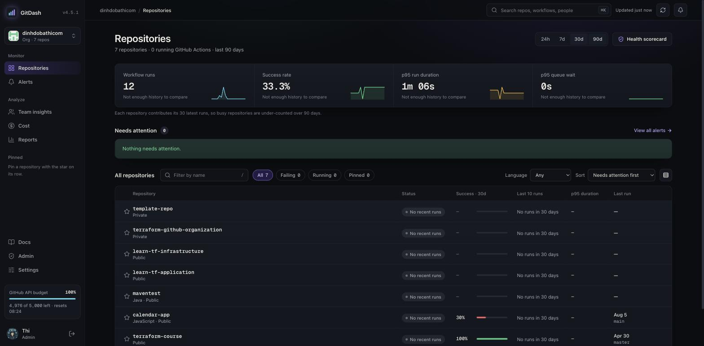
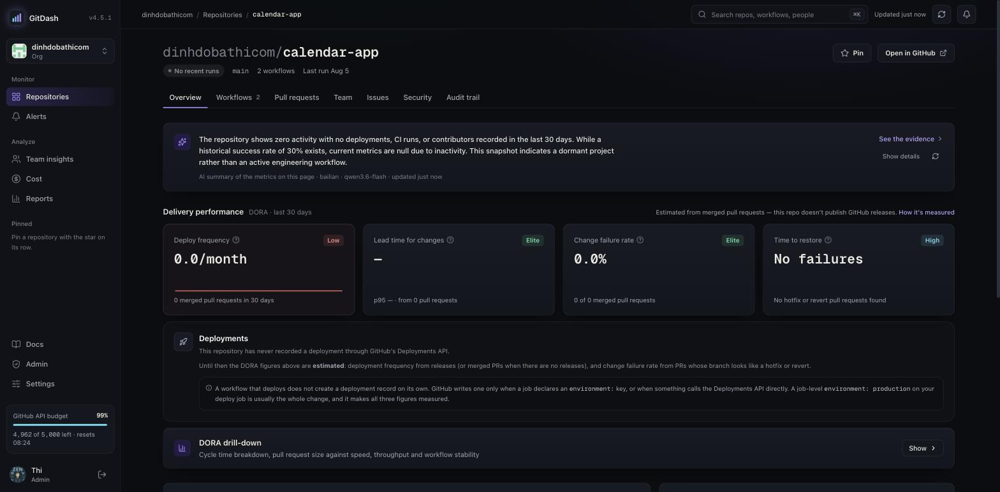
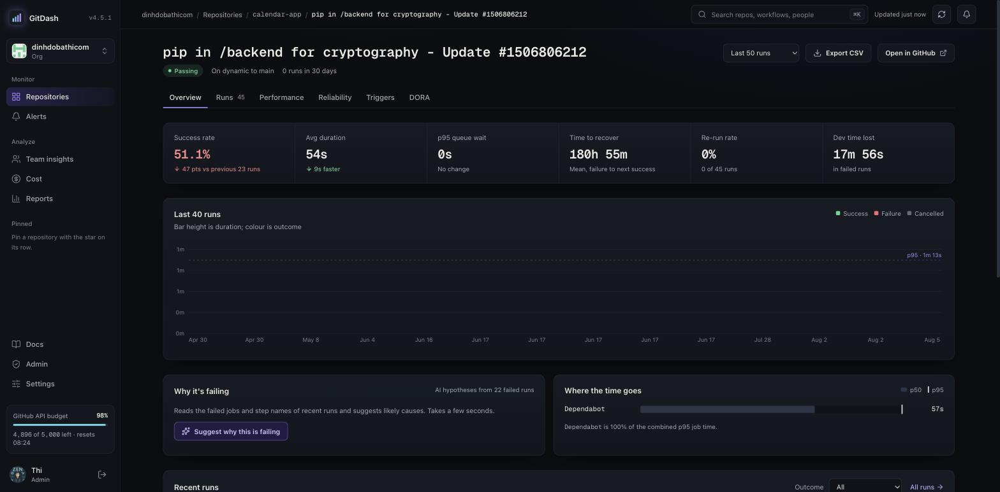
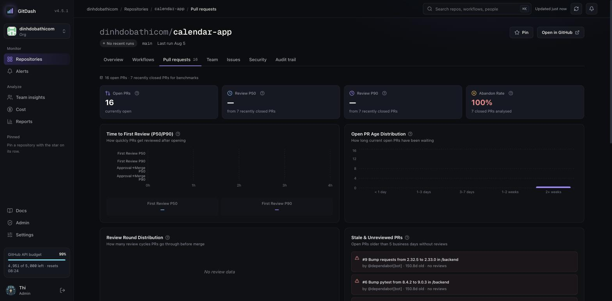
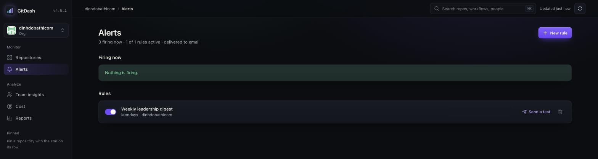
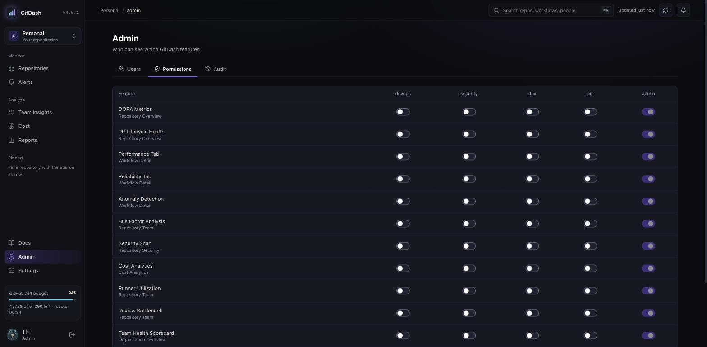
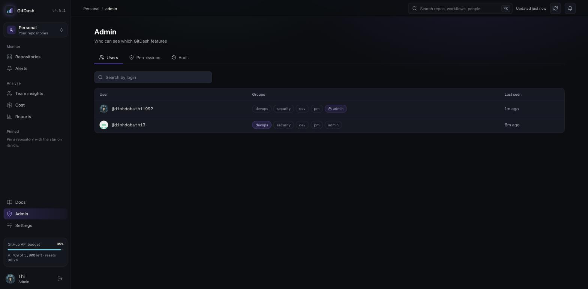
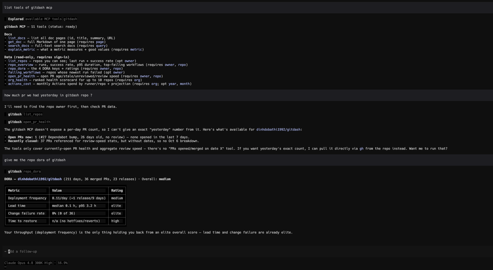

<p align="center">
  
</p>

<h1 align="center">GitDash</h1>

<p align="center">
  <strong>Everything metrics, measured.</strong><br />
  DORA, reliability, cost and team health from your GitHub Actions runs and pull requests — on infrastructure you run yourself.
</p>

<p align="center">
  <a href="#-see-it">See it</a> &nbsp;&bull;&nbsp;
  <a href="#-what-it-does">Features</a> &nbsp;&bull;&nbsp;
  <a href="#-quick-start">Quick start</a> &nbsp;&bull;&nbsp;
  <a href="#-deployment">Deployment</a> &nbsp;&bull;&nbsp;
  <a href="#-access-control-organization-mode">Access control</a> &nbsp;&bull;&nbsp;
  <a href="https://www.gitdash.info/docs">Docs</a>
</p>

<p align="center">
  
  
  
  
  
  
</p>

---

## 👀 See it

<p align="center">
  
</p>

▶ **[Watch the 90-second intro](public/videos/gitdash-4-5-intro.mp4)** — it also plays from **Explore the demo** on the sign-in page.

<details>
<summary><strong>More screenshots</strong></summary>
<br />

| | |
| --- | --- |
|  |  |
| Repository overview — DORA four keys, deployments, outcomes | Workflow detail — why it fails, where the time goes |
|  |  |
| Pull requests — review speed, age, stale PRs | Alerts — rules, what is firing, delivery history |
|  |  |
| Access control — features granted per group | Users and their groups |

</details>

---

## ✨ What it does

| | |
| --- | --- |
| **Delivery metrics** | DORA four keys per repository (from releases, or estimated from merged pull requests), with cycle-time, size-vs-velocity, throughput and stability drill-downs. |
| **Workflow intelligence** | Per workflow: why it fails, where the time goes, slowest jobs and steps, flaky branches, anomaly detection, triggers and concrete ways to speed it up. |
| **Pull requests & people** | Review speed and rounds, stale PRs, reviewer load, bus factor, workload risk, contributor profiles and a printable 1:1 prep sheet. |
| **Team insights** | One 30- or 90-day window per repository: what stands out (worst first), merges reviewed by a human, the reviewer bus factor, who reviews whom, workload against the org workday, and a People table. Admins can link two GitHub logins of one person. |
| **Working habits** | Per engineer: share of oversized commits (over 10 files or 200 lines) and pull requests with more than 20 commits, measured inside merged pull requests so squash merges read correctly. Limits are editable; engineers always see their own figures. Needs a database. |
| **Cost** | GitHub Actions spend by day, runner type and repository, with savings estimates. |
| **Alerts** | Rules on CI and people metrics, delivered in the browser, by email (optionally a daily digest) or to Slack, plus a weekly leadership digest. |
| **Security** | GitHub security alerts per repository and static analysis of workflow files. |
| **Access control** | In organization mode, admins grant features per group; the server enforces it and audits every change. |
| **Built for the rate limit** | GitHub reads are cached per token and shared across replicas through Postgres; the sidebar shows your remaining API budget. |
| **AI insights** *(optional)* | Plain-English analysis of the numbers on screen via Bailian, Gemini or Qwen. Hidden unless a provider key is configured; only metrics and names are sent. |
| **Export** | CSV or JSON from workflow detail, the health scorecard, the contributors table and Cost. |
| **MCP server** | Ask Claude, Cursor or Claude Code about your CI in plain words. `/mcp` serves the docs to any MCP client; `/mcp/me` adds read-only data tools (repositories, DORA, failing workflows, PR health, org health, Actions cost) that see exactly what you see in GitDash. Connect with OAuth sign-in or a personal MCP key from Settings → Connected apps. Off unless `GITDASH_MCP=true`. |


### Ask your AI assistant

Connect GitDash as an MCP server and ask about your delivery metrics from Claude, Cursor or Claude Code. Below, Cursor's agent lists the tools and reads a repository's DORA keys:

<p align="center">
  
</p>

```json
{
  "mcpServers": {
    "gitdash": {
      "url": "https://<your GitDash host>/mcp/me",
      "headers": { "Authorization": "Bearer <personal MCP key from Settings → Connected apps>" }
    }
  }
}
```

See [Docs → MCP server](https://www.gitdash.info/docs/mcp) for the OAuth sign-in, every tool, and how keys are stored and revoked.

---

## ⚡ Quick start

Requires Node.js 20+ and pnpm (`corepack enable pnpm`).

```bash
git clone https://github.com/dinhdobathi1992/gitdash.git
cd gitdash
pnpm install --frozen-lockfile
cp .env.local.example .env.local
```

Set at least:

```env
MODE=standalone
SESSION_SECRET=replace_with_openssl_rand_hex_32
```

```bash
pnpm run dev    # http://localhost:3000 → /setup, paste a personal access token
```

**Token scopes:** a classic PAT needs `repo`, `workflow`, `read:org`, `read:user` and `user:email`. A fine-grained PAT needs read access to Actions, Contents, Metadata and Pull requests; for an organization's repositories, create it with the **organization as resource owner** (and *Members: read* if sign-in is limited to your orgs). The Cost page needs a fine-grained token with the organization's *Administration: read*.

---

## 🔐 Modes

| | `standalone` (default) | `organization` |
| --- | --- | --- |
| For | One person | A team sharing one deployment |
| Sign in | Personal access token on `/setup` | GitHub OAuth or a personal access token on `/login` |
| Database | Optional | `DATABASE_URL` required |
| Who decides what you see | You (Settings → My features) | An admin, per group |
| Alerts, Reports, sync | — | ✓ |

Organization mode also needs a GitHub OAuth App (callback `https://<your-host>/api/auth/callback`) with `GITHUB_CLIENT_ID` and `GITHUB_CLIENT_SECRET`.

---

## 🛡 Access control (organization mode)

- **Identity** is the numeric GitHub id of the signed-in token, looked up from GitHub — never taken from the browser.
- **Groups** are fixed: `admin`, `devops`, `security`, `dev`, `pm`. Admins grant features per group in **Admin** (or Settings → Access by group); a person gets every feature any of their groups has, and can switch granted features off for themselves.
- **New users** land on `/pending` until an admin adds them to a group; the page moves on by itself within about a minute. Every change is written to the audit log.
- **Enforcement** happens on the server in `src/proxy.ts`: without the grant, pages redirect and API routes answer 403. Unregistered API routes are denied.

```env
DATABASE_URL=postgres://...          # required
GITDASH_ADMIN_GITHUB_IDS=12345678     # required: numeric ids (gh api user --jq .id), comma-separated
GITDASH_ALLOWED_ORGS=my-org           # optional: only active members of these orgs may sign in
GITDASH_RBAC_ENFORCE=false            # rollout switch
```

**Rollout:** deploy with enforcement off (everyone keeps access; admin screens are restricted), assign groups and grants, then set `GITDASH_RBAC_ENFORCE=true` and redeploy. The app refuses to start in organization mode without `DATABASE_URL` and `GITDASH_ADMIN_GITHUB_IDS`, and `/api/health` answers 503.

**When sign-in is refused** with `GITDASH_ALLOWED_ORGS` set, GitHub declined to confirm membership:

- The org **restricts OAuth Apps** — an org owner approves the GitDash OAuth App under the org's *Third-party access* settings.
- A **fine-grained PAT created under the user** — recreate it with the org as resource owner and *Members: read* (approved by an owner if the org requires it).
- A **classic PAT** without `read:org`, or one the org rejects for living longer than 366 days.

The server log records GitHub's reason. Details: [Access control](https://www.gitdash.info/docs) in the built-in docs.

---

## 🚢 Deployment

**Docker** — images are published to Docker Hub as `dinhdobathi/gitdash` (`latest`, plus version tags on each release; amd64 and arm64):

```bash
docker run -d -p 3000:3000 -e MODE=standalone -e SESSION_SECRET=... dinhdobathi/gitdash:latest
```

**Docker Compose** — builds locally from `docker-compose.yml` and reads `.env.local`:

```bash
docker compose up --build -d
```

**Kubernetes** — the Helm chart lives in `helm/gitdash`; set organization-mode values (`config.adminGithubIds` as a quoted string, `config.allowedOrgs`, `config.rbacEnforce`, `secret.databaseUrl`) in your values file:

```bash
helm upgrade --install gitdash ./helm/gitdash -n gitdash --create-namespace -f my-values.yaml
```

**Vercel** — import the repository and set the environment variables (changes need a redeploy). `vercel.json` schedules the nightly sync crons, which need `GITHUB_TOKEN` and `CRON_SECRET`. Use one canonical host for the OAuth callback — the sign-in cookie belongs to the host that started sign-in.

---

## ⚙️ Configuration

Every variable is listed with comments in [`.env.local.example`](.env.local.example) and explained in the built-in docs (Configuration). The ones you meet first:

| Variable | |
| --- | --- |
| `SESSION_SECRET` | Required. At least 32 characters. |
| `MODE` | `standalone` (default) or `organization`. |
| `NEXT_PUBLIC_APP_URL` | Public URL, for OAuth redirects. |
| `GITHUB_CLIENT_ID` / `GITHUB_CLIENT_SECRET` | Organization mode: the OAuth App. |
| `DATABASE_URL` | Organization mode: users, groups, audit, alerts, reports and the shared cache. |
| `GITDASH_ADMIN_GITHUB_IDS` / `GITDASH_ALLOWED_ORGS` / `GITDASH_RBAC_ENFORCE` | Organization-mode access control (above). |
| `GITHUB_TOKEN` / `CRON_SECRET` / `GITHUB_WEBHOOK_SECRET` | Nightly sync and the `workflow_run` webhook. |
| `GITDASH_L2_CACHE` / `GITDASH_GH_LOG` | Turn off the shared Postgres cache (`0`); log every GitHub call (`1`). |
| `RESEND_*` / `SMTP_*` | Email delivery for alerts and digests. |
| `BAILIAN_*` / `GEMINI_*` / `QWEN_*` / `AI_*` | Optional AI insights. |

---

## 🏗 How it works

```
Browser ── /api/* ──► src/proxy.ts ──► route handler ──► GitHub REST API
                      │ decrypts the session cookie      │ token read from the session (never sent to the browser)
                      │ org mode: identity + grants      │ cached per token (memory + shared Postgres)
                      ▼                                  ▼
                /login, /setup, /pending            JSON for the page
```

Almost everything is read live from GitHub with the signed-in person's own token. With a database, GitDash also keeps its own history for Reports and alerts: a nightly sync (`/api/cron/sync`, `/api/cron/sync-pr-facts`, `/api/cron/sync-commit-facts`) and the `workflow_run` webhook (`/api/webhooks/github`).

| Path | What lives there |
| --- | --- |
| `src/app/` | Pages, one folder per route; `src/app/api/` holds the API |
| `src/proxy.ts` | Sign-in and access checks for every request |
| `src/lib/permissions.ts` | Route → feature registry used by the proxy |
| `src/lib/` | GitHub client, caching, database and migrations, identity, AI |
| `src/app/docs/` | The built-in documentation (sections in `_parts/`) |
| `helm/gitdash/` | Helm chart |
| `tests/` | Vitest suites |

---

## 🔒 Security

- The GitHub token lives only in an encrypted (iron-session), `HttpOnly`, `SameSite=Lax` cookie — `Secure` in production.
- The session is replaced on every sign-in; cross-site state-changing requests are rejected.
- Sign-in endpoints are rate-limited; owner/repo/org parameters are validated before any GitHub call.
- Organization mode checks every request against the caller's groups on the server; synced data is filtered by what the viewer's own token can see.
- CSP, HSTS and the other security headers are set in `next.config.ts`; the container runs as a non-root user.

More detail: [`README-SECURITY-ENHANCEMENTS.md`](README-SECURITY-ENHANCEMENTS.md) and the built-in docs (Security model).

---

## 🧑‍💻 Development

```bash
pnpm run dev            # development server
pnpm run lint           # eslint
pnpm exec tsc --noEmit  # type check
pnpm run test           # vitest (database tests use in-memory Postgres)
pnpm run build          # production build
```

CI (`.github/workflows/ci.yml`) runs lint, type check, tests, build, a dependency audit, Snyk and CodeQL. Merging to `main` deploys production (`vercel.yml`) and publishes the `latest` image (`docker.yml`); releases are cut with `release.yml`.

---

## 📚 Documentation & changelog

- **Built-in docs:** `/docs` in any running instance — e.g. [www.gitdash.info/docs](https://www.gitdash.info/docs) — covers setup, access control, every screen, metric definitions and the API.
- **Changelog:** [`CHANGELOG.md`](CHANGELOG.md). Release notes: [`docs/releases/`](docs/releases/).

---

## 📄 License

MIT

<p align="center">
  <sub>Made by <a href="https://github.com/dinhdobathi1992">Dinh Do Ba Thi</a></sub>
</p>
